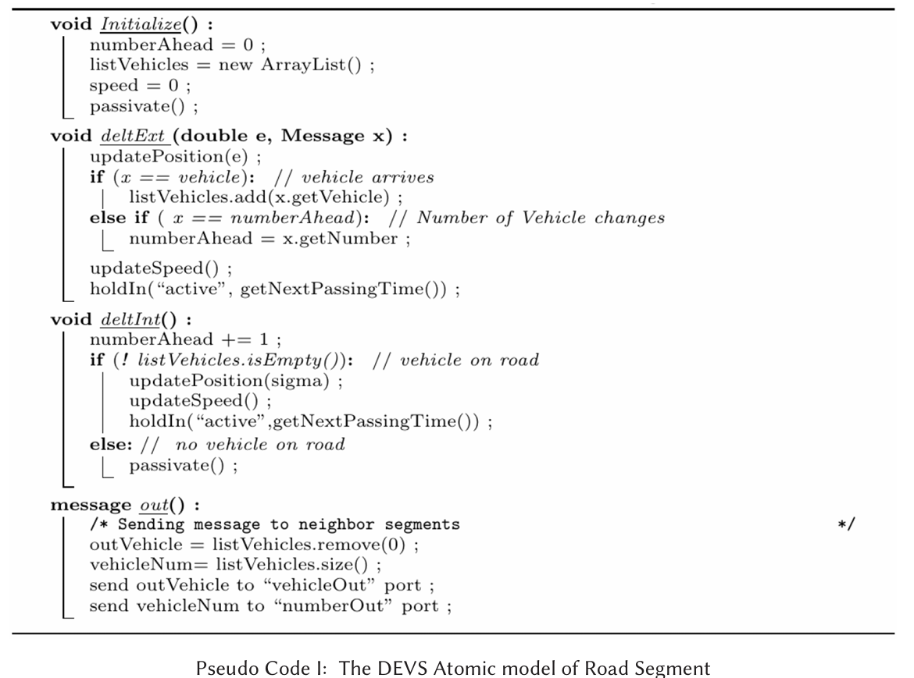
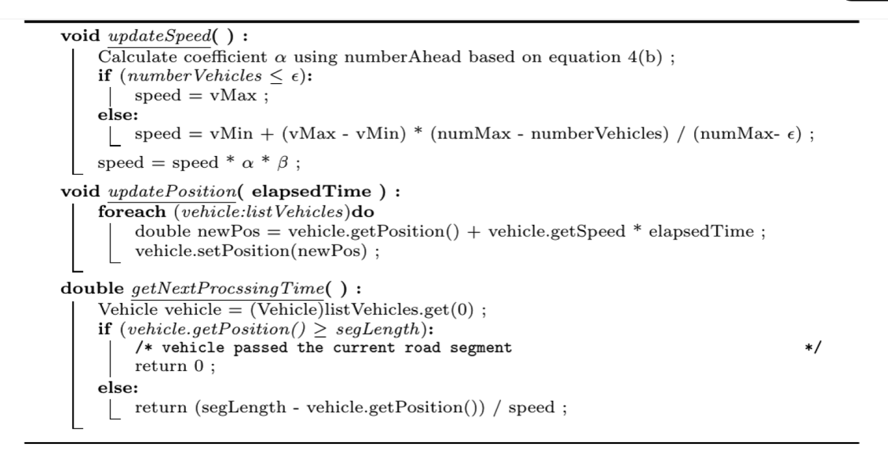

```
Class trafficControlModel extends ViewableAtomic
    Define variables:
        maxElapseTimeWhenBusy, carPassingTime_mean, job, currentJob
        queue_westSide, queue_eastSide
        trafficLightState, initSigma, elapsedTimeInGreen, carPassingTime
        destination_eastMoving, r, phaseBeforeReporting, sigmaBeforeReporting

    Constructor trafficControlModel(name)
        Initialize model with default settings

    Constructor trafficControlModel(name, QWestSideSize, QEastSideSize)
        Initialize model with specific queue sizes for each side

    Constructor trafficControlModel(name, tfcState, sgm, initElapseTimeGreen, QWestSideSize, QEastSideSize, carPassingTime, rd)
        Set up traffic model with detailed parameters

    Method initialize()
        Set initial state and sigma

    Method deltext(e, x)
        Continue model with elapsed time e
        Process incoming messages x:
            Add jobs to queues based on the message port (eastMoving_in, westMoving_in)
            Apply traffic control rules if in passive state
            Handle report messages separately

    Method deltint()
        Update elapsedTimeInGreen
        Handle different phases:
            if(phaseIs(report)) -> holdIn(previous phase)
            if(phaseIs(signalChange)) -> (updateTrafficLightState(), resetElapsedTimeInGreen())
            Apply traffic control rules based on the current traffic light state

    Method applyTrafficControlRules()
        Determine actions based on traffic light state:
            if(stateIs(eastMovingGreen)) -> decide(switchTo(westMoving) or continueWith(eastMoving))
            if(stateIs(westMovingGreen)) -> decide(switchTo(eastMoving) or continueWith(westMoving))
            Handle car movement and queue management based on the state

    Method deltcon(e, x)
        Combine internal and external transitions

    Method out()
        Generate output messages based on the current phase:
            Send currentJob to the appropriate outport
            Send signal change notifications
            Send report state

    Method getCarPassingTime()
        Calculate car passing time using a truncated normal distribution

    Method getTruncatedNormalDistributionRate(low, high, mean, sigma)
        Generate a value within specified bounds using a normal distribution

    Method getTooltipText()
        Provide a tooltip text with current model state information

End Class
```

Design for the multi-car traffic control model

there are two different segment model, one is normal segment, another is terminal segment

1. The sign in different direction will not switch together, passing direction will switch at first, and when all cars passing through the terminal segment, the sign of this terminal will switch.

Middle segmen

The segment will 






1. Terminal segment

Only terminal segment will control the passing direction of the car, and the passing direction will be the same as the previous segment.


